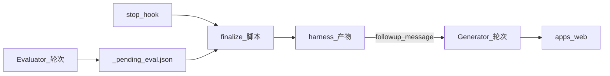

# Harness demo：单 Agent 前端 + Ralph（`stop` hook）+ 生成器 / 评估器分离

本仓库演示 **结构化 harness 产物**（`harness/`）、**Cursor `stop` hook** 驱动的 **Ralph 式迭代**（改—评—再改）。**Generator** 与 **Evaluator** 在流程上严格分离；默认由 **同一 Cursor Agent** 分轮扮演两种角色，脚本侧只做 **确定性后处理**（按 `rubric.json` 重算 `pass`、写 `last_critique.md` / `NEXT_PROMPT.md` / `state.json` / `progress.md`）。

可选 **legacy API 模式**：由独立进程调用 Anthropic Messages API 打分，需 `ANTHROPIC_API_KEY`。

## 目录结构（要点）

| 路径 | 作用 |
|------|------|
| [`apps/web`](apps/web) | Vite + React + TS 前端（默认示例为 `harness/spec.md` 中的待办 MVP） |
| [`harness/spec.md`](harness/spec.md) | 产品需求 |
| [`harness/rubric.json`](harness/rubric.json) | 评分维度与 `pass_score`（`pass` 以脚本重算为准） |
| [`harness/state.json`](harness/state.json) | `iteration` / `max_iterations` / `pass_all` |
| [`harness/_pending_eval.json`](harness/_pending_eval.json) | **仅 cursor 模式**：评审角色写入的原始 JSON（已 gitignore）；`finalize` 成功后会删除 |
| [`harness/last_eval.json`](harness/last_eval.json) | 最近一次 **finalize 之后**的机器可读评测 |
| [`harness/last_critique.md`](harness/last_critique.md) | 人类可读的评审摘要 |
| [`harness/NEXT_PROMPT.md`](harness/NEXT_PROMPT.md) | 下一轮跟进文案（hook 失败时可手贴） |
| [`scripts/finalize.mjs`](scripts/finalize.mjs) | **无 API**：从 pending / `last_eval` 输入跑后处理 |
| [`scripts/evaluator.mjs`](scripts/evaluator.mjs) | 统一入口：`HARNESS_EVAL_MODE` 选择 `cursor`（finalize）或 `api`（Anthropic） |
| [`.cursor/hooks.json`](.cursor/hooks.json) + [`ralph-stop.mjs`](.cursor/hooks/ralph-stop.mjs) | `stop` 时按模式 finalize 或调 API，并可能返回 `followup_message` |

## 环境变量

1. **默认（`HARNESS_EVAL_MODE=cursor`）**：无需大模型 API。可选复制 [`.env.example`](.env.example) 为 `.env`，用于关闭 hook 内 finalize 等开关（见下）。
2. **API 模式**：在 `.env` 中设置 `HARNESS_EVAL_MODE=api` 与 `ANTHROPIC_API_KEY`；可选 `ANTHROPIC_MODEL`（默认见 [`scripts/lib/anthropic.mjs`](scripts/lib/anthropic.mjs)）。

脚本与 hook 会通过 [`scripts/lib/env.mjs`](scripts/lib/env.mjs) 加载根目录 `.env`（不覆盖已有环境变量）。

**`HARNESS_FINALIZE_ON_STOP`**（默认启用）：在 cursor 模式下，若存在 `harness/_pending_eval.json`，`stop` hook 会自动运行 `finalize`。设为 `0` / `false` / `off` 则不在 hook 内 finalize，可改用手动 `pnpm finalize`。

**注意：** Cursor 执行 hook 时的环境未必继承你在交互式 shell 里 `export` 的变量；若 API 模式报缺 key，请使用 `.env` 或在系统层配置变量。

## 开关 Ralph

- **开启**：在仓库根执行 `touch harness/.ralph-enabled`（该路径已加入 `.gitignore`，不会提交）。
- **关闭**：`rm harness/.ralph-enabled`。

仅当存在上述文件时，[`ralph-stop.mjs`](.cursor/hooks/ralph-stop.mjs) 才会在每次 Agent **`stop`** 时尝试处理评测产物；否则向 stdout 打印 `{}`，不干扰正常对话。

## 端到端流程（简图）

### 默认：Cursor 双角色 + 确定性 finalize



1. 编辑 [`harness/spec.md`](harness/spec.md)（或保持默认待办示例）。
2. `touch harness/.ralph-enabled`。
3. **Generator 轮**：在 Cursor 中按 spec 实现 / 修改 `apps/web`，完成后结束本轮。
4. **Evaluator 轮**：以**独立评审**身份在对话中输出符合 `scripts/finalize.mjs` 要求的 JSON，并写入 **`harness/_pending_eval.json`**（或由你运行 `pnpm finalize` 前放入该文件）。
5. 再次 **结束 Agent** 触发 `stop` hook → 若存在 `_pending_eval.json` 且未关闭 `HARNESS_FINALIZE_ON_STOP`，则运行 `finalize` → 更新 `last_eval.json`、`NEXT_PROMPT.md`、`state.json` 等，并**删除** `_pending_eval.json`，避免下一轮误重复 finalize。
6. 若 `pass_all` 仍为 false 且未超过 `max_iterations`：hook 返回 `{"followup_message":"..."}`（来自 `NEXT_PROMPT.md`），可据此开启下一轮 Generator。
7. 若已全部通过或达到 `max_iterations`：返回 `{}`，循环停止。

也可在任意时刻手动执行 **`pnpm finalize`**（与 `pnpm eval` 在 `cursor` 模式下等价），不必等待 hook。

**注意：** cursor 模式下若没有 `harness/_pending_eval.json`，`pnpm finalize` / `pnpm eval` 会回退读取现有的 `last_eval.json` 并再次 **递增 `iteration`**（等同「把上一份已 finalize 的结果又跑了一遍」）。新的一次评审请把原始 JSON 放进 `_pending_eval.json`。

### 可选：独立 API Evaluator

将 `HARNESS_EVAL_MODE=api` 后，`stop` hook 会调用 Anthropic Messages API（需 key），流程与「独立进程打分」一致；脚本仍会用 `rubric.json` 重算 `pass` 并写齐 harness 文件。

## 常用命令

```bash
pnpm dev          # 启动 apps/web 开发服务器
pnpm build        # 构建前端
pnpm finalize     # 无 API：从 _pending_eval.json 或 last_eval.json 后处理
pnpm eval         # 与 finalize 相同（cursor）或 Anthropic 评测（api）
```

## 重置迭代计数

将 [`harness/state.json`](harness/state.json) 中的 `iteration` 置回 `0`，并按需清空或保留 `progress.md` / `last_eval.json`。

## 规则提示

编辑 `apps/web` 时，可启用 Cursor 规则 [`.cursor/rules/harness-frontend.mdc`](.cursor/rules/harness-frontend.mdc)（按 glob 作用于前端目录），提醒 Agent 分轮阅读 harness 产物并遵守 Generator / Evaluator 分工。
