# Harness demo：三角色 Ralph 循环 - 设计器 → 生成器 → 评价器

本仓库完整实现 Anthropic 《Harness Design for Long-Running Apps》文章描述的 **三角色全自动 AI 辅助开发工作流**：

1. **设计器 Designer** - 从模糊原始需求产出结构化产品规格和量化评估标准
2. **生成器 Generator** - 按规格实现前端代码，根据评价反馈迭代改进
3. **评价器 Evaluator** - 对照标准逐条打分，不通过给出具体改进项

三种角色严格分离，配合 Cursor `stop` hook 可实现全自动循环迭代，直到满足所有要求。默认由 **同一 Cursor Agent** 分轮扮演三种角色，脚本侧只做 **确定性后处理**。可选 API 模式独立调用 Anthropic API。

## 目录结构（要点）

| 路径 | 作用 |
|------|------|
| [`apps/web`](apps/web) | Vite + React + TS 前端实现 |
| [`harness/design_spec.md`](harness/design_spec.md) | **设计阶段输入**：原始用户需求，人工填写 |
| [`harness/spec.md`](harness/spec.md) | **设计阶段输出**：结构化产品需求规格 |
| [`harness/rubric.json`](harness/rubric.json) | 评分维度与 `pass_score`（`pass` 以脚本重算为准） |
| [`harness/state.json`](harness/state.json) | `iteration` / `max_iterations` / `pass_all` 迭代状态 |
| [`harness/_pending_design.json`](harness/_pending_design.json) | **仅 cursor 模式**：设计角色写入的原始 JSON；finalize 后删除 |
| [`harness/_pending_eval.json`](harness/_pending_eval.json) | **仅 cursor 模式**：评审角色写入的原始 JSON；finalize 后删除 |
| [`harness/last_design.json`](harness/last_design.json) | 最近一次设计结果（机器可读） |
| [`harness/last_eval.json`](harness/last_eval.json) | 最近一次评测结果（机器可读） |
| [`harness/last_critique.md`](harness/last_critique.md) | 最近一次评审摘要（人类可读） |
| [`harness/NEXT_PROMPT.md`](harness/NEXT_PROMPT.md) | 下一轮角色跟进文案 |
| [`harness/progress.md`](harness/progress.md) | 迭代进度日志 |
| [`scripts/designer.mjs`](scripts/designer.mjs) | 设计器统一入口 |
| [`scripts/evaluator.mjs`](scripts/evaluator.mjs) | 评价器统一入口 |
| [`scripts/finalize.mjs`](scripts/finalize.mjs) | 确定性后处理 |
| [`docs/RALPH_WORKFLOW.md`](docs/RALPH_WORKFLOW.md) | 完整工作流说明 |
| [`.cursor/hooks.json`](.cursor/hooks.json) + [`ralph-stop.mjs`](.cursor/hooks/ralph-stop.mjs) | `stop` hook，自动触发后处理和下一轮 |

## 环境变量

1. **默认（`HARNESS_EVAL_MODE=cursor`）**：无需大模型 API。可选复制 [`.env.example`](.env.example) 为 `.env`，用于关闭 hook 内 finalize 等开关（见下）。
2. **API 模式**：在 `.env` 中设置 `HARNESS_EVAL_MODE=api` 与 `ANTHROPIC_API_KEY`；可选 `ANTHROPIC_MODEL`（默认见 [`scripts/lib/anthropic.mjs`](scripts/lib/anthropic.mjs)）。

脚本与 hook 会通过 [`scripts/lib/env.mjs`](scripts/lib/env.mjs) 加载根目录 `.env`（不覆盖已有环境变量）。

**`HARNESS_FINALIZE_ON_STOP`**（默认启用）：在 cursor 模式下，若存在 `harness/_pending_eval.json`，`stop` hook 会自动运行 `finalize`。设为 `0` / `false` / `off` 则不在 hook 内 finalize，可改用手动 `pnpm finalize`。

**注意：** Cursor 执行 hook 时的环境未必继承你在交互式 shell 里 `export` 的变量；若 API 模式报缺 key，请使用 `.env` 或在系统层配置变量。

## 开关 Ralph

- **开启**：在仓库根执行 `touch harness/.ralph-enabled`（该路径已加入 `.gitignore`，不会提交）。
- **关闭**：`rm harness/.ralph-enabled`。

仅当存在上述文件时，[`ralph-stop.mjs`](.cursor/hooks/ralph-stop.mjs) 才会在每次 Agent **`stop`** 时尝试处理评测产物；否则向 stdout 打印 `{}`，不干扰正常对话。

## 完整三角色端到端流程

### 默认：Cursor 分三角色 + 确定性后处理（推荐）

```mermaid
flowchart LR
  A[harness/design_spec.md<br/>人工填写原始需求] --> D[Designer_轮次<br/>在Cursor中扮演设计角色]
  D --> PendingD[_pending_design.json]
  PendingD --> Des[pnpm design]
  Des --> Spec[spec.md + rubric.json<br/>state.json + NEXT_PROMPT.md]
  Spec --> G[Generator_轮次<br/>按 spec 实现 apps/web]
  G --> Web[apps_web]
  Web --> E[Evaluator_轮次<br/>独立评审打分]
  E --> PendingE[_pending_eval.json]
  PendingE --> Fin[pnpm finalize]
  Fin --> Files[last_eval.json<br/>last_critique.md]
  Files --> pass{pass_all?}
  pass -->|否| G
  pass -->|是| Done[✅ 完成]
```



完整文档参见 [docs/RALPH_WORKFLOW.md](docs/RALPH_WORKFLOW.md)。

### 可选：独立 API 模式

设计器和评价器都支持独立调用 Anthropic Messages API，无需在 Cursor 对话内分轮：

- `HARNESS_DESIGN_MODE=api pnpm design` - 自动生成 spec 和 rubric
- `HARNESS_EVAL_MODE=api pnpm eval` - 自动打分和后处理

两种模式都需要 `ANTHROPIC_API_KEY`。

## 常用命令

```bash
pnpm dev          # 启动 apps/web 开发服务器
pnpm build        # 构建前端
pnpm design       # 设计阶段：后处理设计结果，生成 spec.md + rubric.json + 初始化状态
pnpm eval         # 评价阶段：与 finalize 相同（cursor）或 Anthropic 评测（api）
pnpm finalize     # 确定性后处理（cursor 模式下从 pending 文件生成最终产物）
```

## 重置迭代计数

将 [`harness/state.json`](harness/state.json) 中的 `iteration` 置回 `0`，并按需清空或保留 `progress.md` / `last_eval.json`。

## 规则提示

编辑 `apps/web` 时，可启用 Cursor 规则 [`.cursor/rules/harness-frontend.mdc`](.cursor/rules/harness-frontend.mdc)（按 glob 作用于前端目录），提醒 Agent 分轮阅读 harness 产物并遵守 Generator / Evaluator 分工。
