[🇨🇳 简体中文](README.zh-CN.md)

# Harness Demo: 3-Agent Ralph Loop - Designer → Generator → Evaluator

This repository fully implements the **3-agent fully automated AI-assisted development workflow** described in Anthropic's article [Harness Design for Long-Running Apps](https://www.anthropic.com/engineering/harness-design-for-long-running-apps):

1. **Designer** - Transforms vague raw requirements into structured product specifications and quantitative evaluation criteria
2. **Generator** - Implements frontend code according to specifications, iteratively improves based on evaluation feedback
3. **Evaluator** - Scores against criteria item by item, provides specific improvements when failing

Strict separation of three roles, combined with Cursor `stop` hook, enables fully automatic iterative loop until all requirements are met. By default, the **same Cursor Agent** plays three roles in separate rounds, scripts only do **deterministic post-processing**. Optional API mode for independent Anthropic API calls.

## Key Directory Structure

| Path | Purpose |
|------|---------|
| [`apps/web`](apps/web) | Vite + React + TS frontend implementation |
| [`harness/design_spec.md`](harness/design_spec.md) | **Design Input**: Raw user requirements, filled manually |
| [`harness/spec.md`](harness/spec.md) | **Design Output**: Structured product requirements specification |
| [`harness/rubric.json`](harness/rubric.json) | Evaluation dimensions with `pass_score` (pass status recomputed by script) |
| [`harness/state.json`](harness/state.json) | Iteration state: `iteration` / `max_iterations` / `pass_all` |
| [`harness/_pending_design.json`](harness/_pending_design.json) | **cursor mode only**: Raw JSON written by designer role; deleted after finalize |
| [`harness/_pending_eval.json`](harness/_pending_eval.json) | **cursor mode only**: Raw JSON written by evaluator role; deleted after finalize |
| [`harness/last_design.json`](harness/last_design.json) | Latest design result (machine-readable) |
| [`harness/last_eval.json`](harness/last_eval.json) | Latest evaluation result (machine-readable) |
| [`harness/last_critique.md`](harness/last_critique.md) | Latest review summary (human-readable) |
| [`harness/NEXT_PROMPT.md`](harness/NEXT_PROMPT.md) | Next prompt for the next role |
| [`harness/progress.md`](harness/progress.md) | Iteration progress log |
| [`scripts/designer.mjs`](scripts/designer.mjs) | Designer entry point |
| [`scripts/evaluator.mjs`](scripts/evaluator.mjs) | Evaluator entry point |
| [`scripts/finalize.mjs`](scripts/finalize.mjs) | Deterministic post-processing |
| [`docs/RALPH_WORKFLOW.md`](docs/RALPH_WORKFLOW.md) | Complete workflow documentation (Chinese) |
| [`.cursor/hooks.json`](.cursor/hooks.json) + [`ralph-stop.mjs`](.cursor/hooks/ralph-stop.mjs) | `stop` hook, automatically triggers post-processing and next round |

## Environment Variables

1. **Default (`HARNESS_EVAL_MODE=cursor`)**: No LLM API required. Optionally copy [`.env.example`](.env.example) to `.env` to toggle hooks settings.
2. **API mode**: Set `HARNESS_EVAL_MODE=api` and `ANTHROPIC_API_KEY` in `.env`; optionally `ANTHROPIC_MODEL` (default see [`scripts/lib/anthropic.mjs`](scripts/lib/anthropic.mjs)).

Scripts and hooks load `.env` from root via [`scripts/lib/env.mjs`](scripts/lib/env.mjs) (does not overwrite existing environment variables).

**`HARNESS_FINALIZE_ON_STOP`** (enabled by default): In cursor mode, if `harness/_pending_eval.json` exists, `stop` hook will automatically run `finalize`. Set to `0` / `false` / `off` to disable, use manual `pnpm finalize` instead.

**Note:** The environment when Cursor executes hooks may not inherit `export` variables from your interactive shell. If API mode reports missing key, please use `.env` or configure variables at system level.

## Toggle Ralph

- **Enable**: Run `touch harness/.ralph-enabled` at repo root (this path is in `.gitignore`, won't be committed).
- **Disable**: `rm harness/.ralph-enabled`.

Only when this file exists, [`ralph-stop.mjs`](.cursor/hooks/ralph-stop.mjs) will attempt to process evaluation artifacts on each Agent **`stop`**; otherwise prints `{}` to stdout and doesn't interfere with normal conversation.

## Complete 3-Agent End-to-End Workflow

### Default: 3 Roles in Cursor + Deterministic Post-processing (Recommended)

```mermaid
flowchart LR
  A[harness/design_spec.md<br/>Manual raw requirements] --> D[Designer Round<br/>Act as designer in Cursor]
  D --> PendingD[_pending_design.json]
  PendingD --> Des[pnpm design]
  Des --> Spec[spec.md + rubric.json<br/>state.json + NEXT_PROMPT.md]
  Spec --> G[Generator Round<br/>Implement apps/web per spec]
  G --> Web[apps/web]
  Web --> E[Evaluator Round<br/>Independent review & scoring]
  E --> PendingE[_pending_eval.json]
  PendingE --> Fin[pnpm finalize]
  Fin --> Files[last_eval.json<br/>last_critique.md]
  Files --> pass{all pass?}
  pass -->|No| G
  pass -->|Yes| Done[✅ Complete]
```



See [docs/RALPH_WORKFLOW.md](docs/RALPH_WORKFLOW.md) for full documentation (Chinese).

### Optional: Standalone API Mode

Both Designer and Evaluator support independent calling of Anthropic Messages API, no need for separate rounds in Cursor conversation:

- `HARNESS_DESIGN_MODE=api pnpm design` - Auto-generate spec and rubric
- `HARNESS_EVAL_MODE=api pnpm eval` - Auto-score and post-process

Both modes require `ANTHROPIC_API_KEY`.

## Common Commands

```bash
pnpm dev          # Start apps/web dev server
pnpm build        # Build frontend
pnpm design       # Design phase: post-process design results, generate spec.md + rubric.json + initialize state
pnpm eval         # Evaluation phase: same as finalize (cursor) or Anthropic evaluation (api)
pnpm finalize     # Deterministic post-processing (from pending file to final artifacts in cursor mode)
```

## Reset Iteration Count

Set `iteration` back to `0` in [`harness/state.json`](harness/state.json), clear or keep `progress.md` / `last_eval.json` as needed.

## Rules Hint

When editing `apps/web`, you can enable the Cursor rule [`.cursor/rules/harness-frontend.mdc`](.cursor/rules/harness-frontend.mdc) (applies to frontend directory via glob), reminds the Agent to read harness artifacts in separate rounds and follow Generator/Evaluator separation.